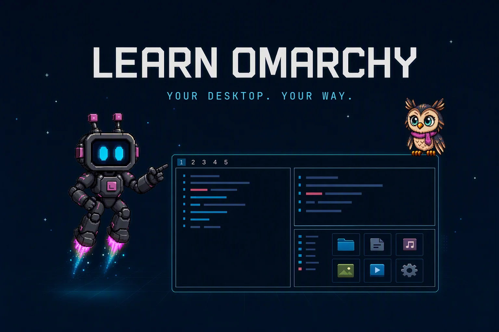

# Learn Omarchy

Learn Omarchy is an interactive desktop course that teaches Omarchy through
guided, hands-on practice. Choose Ohm-1 or Ollie as your guide, follow them to
the part of the desktop being discussed, and use the real shortcuts to complete
each activity.

[Visit the website](https://danwahlin.github.io/learn-omarchy/) for a visual
overview, lesson list, and installation walkthrough.

Arcade adds three safe games with targeted recall practice, repeatable
score challenges, and a simulated desktop mission. Learning progress stays
local and separate from lesson progress. See [the arcade guide](docs/arcade-prototypes.md).



## What you will learn

The bundled course contains 16 lessons and 93 activities covering:

- The Omarchy bar, menus, apps, and everyday desktop navigation
- Window management, workspaces, and the scratchpad
- Clipboard, Compose, screenshots, screen recording, OCR, and QR tools
- Audio, network, power, calendar, backgrounds, and themes
- Updates, setup, productivity tools, and local sharing workflows

Core lessons establish the essentials first. Optional lessons and activities
can be explored at any time without blocking course completion.

## How it works

- Your guide points to the desktop area used by each lesson.
- Narration and captions explain what to do.
- Keycaps respond as you press the real shortcut.
- Omarchy and Hyprland state confirm the expected result.
- Help can demonstrate an action when you get stuck.
- Practice mode hides the answer so you can test your recall.
- Progress and preferences are saved automatically.

Narration, captions, text size, automatic advancement, and motion can all be
adjusted in Settings.
Resetting progress clears lesson completion, including Welcome. Starting or
skipping the welcome does not complete it; finishing it does. The separate
"welcome seen" preference only prevents repeated automatic introductions.

When using a virtual machine, the host can intercept shortcuts before Omarchy
receives them. For example, Super+Ctrl+D corresponds to macOS's
Control+Command+D dictionary shortcut. Use your VM viewer's keyboard-capture
feature to send shortcuts to the guest, or choose Help to demonstrate the
lesson's action. Learn Omarchy uses the standard Omarchy shortcuts.

## Requirements

Learn Omarchy runs on an updated Omarchy installation. The package requires
Omarchy 4.0.3 or newer, Quickshell 0.3 or newer, Hyprland, Node.js 22.6 or
newer, and the runtime tools listed in
[`packaging/PKGBUILD.in`](packaging/PKGBUILD.in). Pacman resolves required
dependencies when the package is installed.

## Install

Update Omarchy, then install Learn Omarchy from the package repository:

```bash
omarchy update
omarchy pkg add learn-omarchy
```

Press **Super + Space**, type **Learn Omarchy**, and press Enter. You can also
launch it from a terminal:

```bash
learn-omarchy
```

See [GitHub Releases](https://github.com/DanWahlin/learn-omarchy/releases) for
release notes and downloadable artifacts.

The package includes the application, both guides, narration, and course
content. It doesn't install anything into your Omarchy configuration.

Guides point at bar items using Omarchy's supported bar measurements on
single-monitor desktops. Omarchy doesn't expose the position of open menus,
panels, or individual workspace buttons, so those targets use layout estimates.
Only affected lesson targets show contextual guidance; persistent geometry
diagnostics are in Settings, not a banner over lessons or Arcade. On
multi-monitor desktops, the app doesn't guess which output contains a widget.
Background measurements do not hide existing guidance or interrupt a tour
caption after the guide has arrived.
Top-bar pointing uses each guide's registered fingertip position to stay close
to the target while keeping the character clear of the bar.
After a workspace switch, the guide also points to inferred buttons within a
measured bar; these remain estimates, without a falsely precise target marker.
Bar and window/panel geometry refresh on relevant lesson, workspace, monitor,
and panel/window events, not recurring timers. Overlapping requests are combined,
and an unavailable detailed provider is not retried until the app restarts.
Internal widget layout changes or window movement without a desktop event may
wait until the next relevant event or lesson step to be measured again.
Short, bounded retries while a newly launched window is appearing remain.

### Update

Run `omarchy update` to install new releases. Your progress and preferences
are retained.

### Remove

Run the following as your regular user:

```bash
learn-omarchy --uninstall
```

The package is removed. Learning progress, backups, user-edited files, and
unrelated plugins are preserved. Releases before 0.2.4 installed a
`learn-omarchy.geometry` shell plugin; `--uninstall` also removes an unchanged
copy.

## Safety and privacy

Learn Omarchy is designed to teach without taking ownership of your desktop:

- It does not modify packaged Omarchy files or your Hyprland configuration.
- Exercise data, screenshots, recordings, and practice files remain local.
- Clipboard practice does not read or log your previous clipboard contents.
- Lock-screen and microphone activities require an explicit choice and can be
  skipped.
- Tutorial windows are identified before window-changing actions run.
- Existing personal windows and browser profiles are not reused as tutorial
  targets.
- Skipping or leaving a menu activity only closes the menu if that activity
  opened it.
- Missing or unsupported tools produce guidance instead of being installed
  automatically.

Progress is stored locally at:

```text
${XDG_STATE_HOME:-$HOME/.local/state}/learn-omarchy/
```

Some exercises create local practice files in `.learn-omarchy-practice/` under
the launch directory. Their exact location is shown during the exercise.

## Run from source

For development on an Omarchy desktop:

```bash
git clone https://github.com/DanWahlin/learn-omarchy.git
cd learn-omarchy
npm ci
./bin/learn-omarchy
```

Run the validation and test suites:

```bash
npm run check
npm test
npm run test:ui
```

The QML suite runs offscreen with private state and does not connect to your
live desktop session. See [`packaging/CI.md`](packaging/CI.md) for the complete
CI and release checks.

To register the checkout in your Apps menu during development:

```bash
make dev-launcher
```

Remove that development launcher with:

```bash
make dev-launcher-remove
```

For trusted source builds and release packaging, follow
[`packaging/RELEASING.md`](packaging/RELEASING.md).

## Characters and custom courses

Ohm-1 and Ollie use the same data-driven character-pack system available to
community guides. Custom courses use a validated JSON format and can be
launched without rebuilding the application.

```bash
learn-omarchy --character owl
learn-omarchy --course /path/to/course.json
```

Detailed authoring documentation:

- [Character packs](docs/character-packs.md)
- [Character intros](docs/character-intros.md)
- [Course structure and retention](docs/curriculum-expansion.md)
- [Presentation and interaction design](docs/presentation.md)
- [Narration production](audio/README.md)

## Project structure

| Path | Purpose |
|---|---|
| `app/` | Quickshell/QML interface and course runtime |
| `assets/characters/` | Bundled character packs |
| `courses/` | Course content and narration |
| `src/` | TypeScript schemas and validation |
| `tests/` | Runtime, metadata, safety, and UI tests |
| `tools/` | Validation, packaging, and content tooling |
| `packaging/` | Arch package and release documentation |
| `docs/` | Website and focused technical guides |

## Contributing

Bug reports, lesson feedback, and focused improvements are welcome through
[GitHub Issues](https://github.com/DanWahlin/learn-omarchy/issues).

Before submitting code, run:

```bash
npm run check
npm test
```

Run `npm run test:ui` as well when changing QML, controls, character rendering,
or interaction behavior.

## License

Source code and technical documentation are licensed under
[MIT](LICENSE). Original artwork and course content are licensed under
[CC BY 4.0](LICENSE-ASSETS.md). Separately licensed assets retain the terms
recorded in their provenance files.
